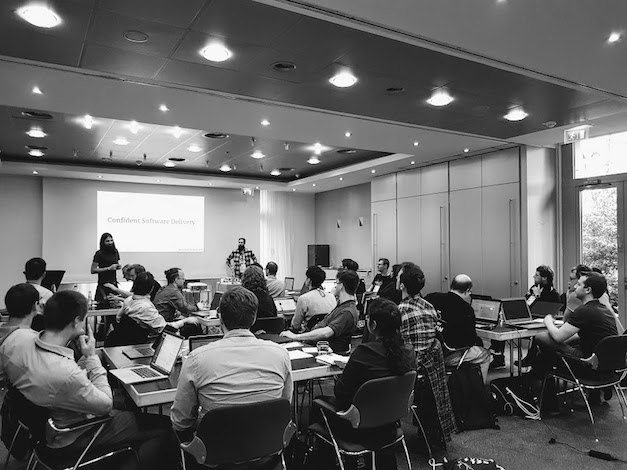

# Confident Software Delivery

I'm the living repository provided as companion material to the workshop “Confident Software Delivery”, so far facilitated at:

- [Agile Testing Days 2018](https://agiletestingdays.com/2018/session/confident-software-delivery/) @ Berlin (November 13th, 2018).

Crafted with ❤️ by Daniel Carral ([@dcarral](https://twitter.com/dcarral)) & Sergio Álvarez ([@codecoolture](https://twitter.com/codecoolture)).

**Note**: workshop participants are guided to complete several tasks on top of a web application specifically designed for this activity. Although this material isn't publicly available yet, we'd be happy to provide access upon request.

## ToC

<!-- TOC depthFrom:1 depthTo:6 withLinks:1 updateOnSave:1 orderedList:0 -->

- [Confident Software Delivery](#confident-software-delivery)
	- [ToC](#toc)
	- [Abstract](#abstract)
	- [Workshop design & facilitation](#workshop-design-facilitation)
	- [Introduction to Software Delivery](#introduction-to-software-delivery)
		- [Context and definition](#context-and-definition)
		- [The moral of the story](#the-moral-of-the-story)
		- [Performance metrics](#performance-metrics)
	- [The jargon of software delivery](#the-jargon-of-software-delivery)
		- [FAQ: CI vs CD](#faq-ci-vs-cd)
		- [Deployment pipeline](#deployment-pipeline)
	- [GitLab CI/CD](#gitlab-cicd)
		- [Core concepts: jobs & stages](#core-concepts-jobs-stages)
		- [How to set up a pipeline in your project?](#how-to-set-up-a-pipeline-in-your-project)
		- [GitLab documentation](#gitlab-documentation)
	- [External resources](#external-resources)
		- [Books](#books)
		- [Websites](#websites)

<!-- /TOC -->

## Abstract 

> Who doesn’t want to deliver value to their customers as soon as possible? In a world where time-to-market dictates the success or failure of many companies, confidently and quickly releasing software isn’t a competitive advantage anymore, it’s a must-have.
> 
> In this workshop we apply modern tools and techniques allowing developers and testers to run automated test suites, set up new testing environments with ease and automatically deliver new features and changes with confidence.
> 
> On top of that, the facilitators strive to create a psychologically safe space where participants, besides getting to know each other, are able to engage in healthy discussions about software delivery and decide what to put into practice back in their teams. 

## Workshop design & facilitation

This activity has been designed to leverage the power of [Liberating Structures (LS)](http://www.liberatingstructures.com/), which are a collection of “simple rules that make it easy to include and unleash everyone in shaping the future” meant to improve the way we work together.

Here you can find more information about the specific structures we are using in this workshop:

- [Impromptu Networking](http://www.liberatingstructures.com/2-impromptu-networking/)
- [TRIZ](http://www.liberatingstructures.com/6-making-space-with-triz/) with [1-2-4-All](http://www.liberatingstructures.com/1-1-2-4-all/)
- [Troika Consulting](http://www.liberatingstructures.com/8-troika-consulting/) with [Wise Crowds](http://www.liberatingstructures.com/13-wise-crowds/)

Would you like to implement them at your workplace? Have you already used them and would like to share how it went? We'd be happy to hear from you :)

## Introduction to Software Delivery

### Context and definition

After the release in 2018 of the book *Accelerate: The Science of Lean Software and DevOps: Building and Scaling High Performing Technology Organizations*, we can assert with confidence that **high IT performance correlates with strong business performance**, helping to boost productivity, profitability, and market share.

When we talk about software delivery, we're using Martin Fowler's definition: “**the journey from commit to production**”.

### The moral of the story

> **Improvements in software delivery are possible for every team and in every company**, as long as leadership provides consistent support -including time, actions and resources- demonstrating a true commitment to improvement, and as long as team members commit themselves to work.

We expect you to leave this workshop with a solid understanding of key principles behind software delivery performance, hands-on experience creating and optimizing a deployment pipeline, as well as a couple of prioritized action items to put into practice back in their daily jobs. 

### Performance metrics

There are four key metrics we can use to effectively measure software delivery performance:

1. Delivery lead time
2. Deployment frequency
3. Mean Time to Restore (MTTR)
4. Change fail rate

Below you can find a brief explanation of each of them, all being excerpts from *Accelerate*:
  
> The elevation of lead time as a metric is a key element of Lean Theory. We measured **product delivery lead time** as the time it takes to go from code committed to code successfully running in production.

> The second metric to consider is batch size. Reducing batch size is another central element of the Lean paradigm. In software, batch size is hard to measure and communicate across contexts as there is no visible inventory. Therefore, we settled on **deployment frequency** as a proxy for batch size since it is easy to measure and typically has low variability.”
  
> Delivery lead times and deployment frequency are both measures of software delivery performance **tempo**. However, we wanted to investigate whether teams who improved their performance were doing so at the expense of the **stability** of the systems they were working on.

> Traditionally, **reliability** is measured as time between failures. However, in modern software products and services, which are rapidly changing complex systems, failure is inevitable, so the key question becomes: how quickly can service be restored?” (and therefore our two other measures: **Mean Time to Restore (MTTR)** and **Change Fail Rate**)

## The jargon of software delivery

### FAQ: CI vs CD

- **Continuous Integration (CI)**: “Development practice that requires developers to integrate code into a shared repository several times a day. Each check-in is then verified by an automated build, allowing teams to detect problems early“ (from  https://www.thoughtworks.com/continuous-integration).

- **Continuous Delivery (CD)**: “Software development discipline where you build software in such a way that it can be released to production at any time” (from https://martinfowler.com/bliki/ContinuousDelivery.html)

- On the other hand, **Continuous Deployment**: 

  > Sometimes confused with Continuous Delivery, it means that every change goes through the pipeline and automatically gets put into production, resulting in many production deployments every day.

  > Continuous Delivery just means that you are able to do frequent deployments but may choose not to do it, usually due to businesses preferring a slower rate of deployment.

  from https://martinfowler.com/bliki/ContinuousDelivery.html.

Please note that, besides the aforementioned differences between them, they all have something they need to exist: **automation**.

### Deployment pipeline

Martin Fowler took some time on May 2013 to document the [concept of deployment pipeline](https://martinfowler.com/bliki/DeploymentPipeline.html) as a way to deal with one of the challenges of an automated build and test environment: you want your build to be fast, so that you can get fast feedback, but comprehensive tests take a long time to run.

A deployment pipeline allows this by breaking up the **build** into **stages**. Each stage provides **increasing confidence**, usually at the cost of extra time. Early stages can find most problems yielding faster feedback, while later stages provide slower and more through probing.

Please note that since Martin Fowler hasn't updated the article lately, it doesn't reflect the current state of the art anymore. As frequently highlighted in *Accelerate*, top performers are the ones who improve more, and faster.

## GitLab CI/CD

This hands-on workshop leverages the so-called *GitLab CI/CD*, which is their built-in Continuous Integration, Continuous Deployment, and Continuous Delivery support to build, test, and deploy applications.

### Core concepts: jobs & stages

Simply put, a deployment **pipeline** consists of groups of **jobs** that get executed in **stages** (batches):

- [**Jobs**](https://docs.gitlab.com/ee/ci/yaml/README.html#jobs) run independently from each other and are executed within the environment of a so-called _runner_.

- [**Stages**](https://docs.gitlab.com/ee/ci/yaml/README.html#stages) allow to group jobs so they can be executed in parallel. If they all succeed, the pipeline moves on to the next stage.

### How to set up a pipeline in your project?

All what you need is a `.gitlab-ci.yml` file placed at the root directory of your repository to specify how the project should be built.

What do we need to include there? Time to dive into some of the resources below.

### GitLab documentation

Here we have cherry-picked some articles from the [GitLab CI/CD docs](https://docs.gitlab.com/ee/ci/README.html):

- [Configuration of your jobs with .gitlab-ci.yml](https://docs.gitlab.com/ee/ci/yaml/)
- [GitLab CI/CD variables](https://docs.gitlab.com/ee/ci/variables/README.html)
- [Introduction to pipelines and jobs](https://docs.gitlab.com/ee/ci/pipelines.html)
- [Cache dependencies in GitLab CI/CD](https://docs.gitlab.com/ee/ci/caching/)
- [Introduction to environments and deployments](https://docs.gitlab.com/ee/ci/environments.html)

Additionally, it might be worth reading:

- [Job artifacts](https://docs.gitlab.com/ee/user/project/pipelines/job_artifacts.html)
- [Run jobs sequentially, in parallel or build a custom pipeline](https://about.gitlab.com/2016/07/29/the-basics-of-gitlab-ci/)

## External resources 

### Books

- [Accelerate: The Science of Lean Software and DevOps: Building and Scaling High Performing Technology Organizations](https://www.amazon.com/Accelerate-Software-Performing-Technology-Organizations/dp/1942788339)
- [Continuous Delivery: Reliable Software Releases through Build, Test, and Deployment Automation ](https://www.amazon.com/Continuous-Delivery-Deployment-Automation-Addison-Wesley/dp/0321601912)

### Websites

- [Continuous Delivery](https://continuousdelivery.com/)
- [Trunk Based Development: Introduction](https://trunkbaseddevelopment.com/)
